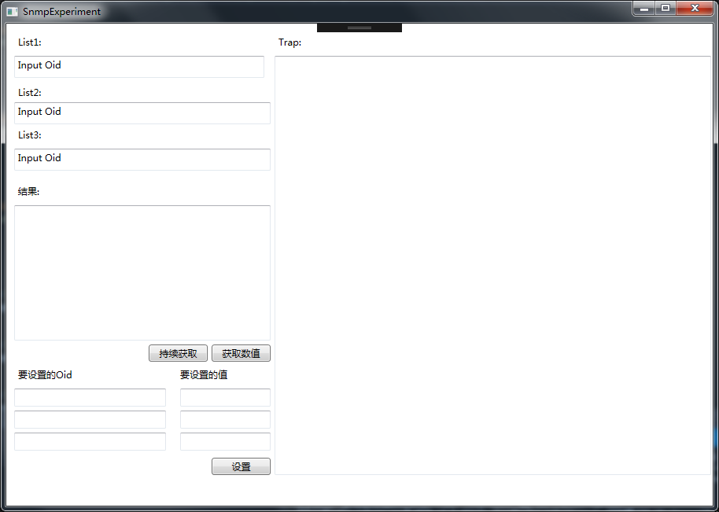

# 概览
## 项目综述
该项目旨在为后续LMT的SNMP模块设计起到一个实验的作用，且在snmp_window项目中实现了一个LMT微客户端的功能，即可以在该界面下直接查询或设置基站对应节点数值

## 迭代记录
### V1.0 ：全部使用OID进行查询设置
- 实现snmp基本功能，即SetRequest、GetRequest和Trap接收功能
- 主界面直接使用OID进行节点的查询或设置

# API接口说明
